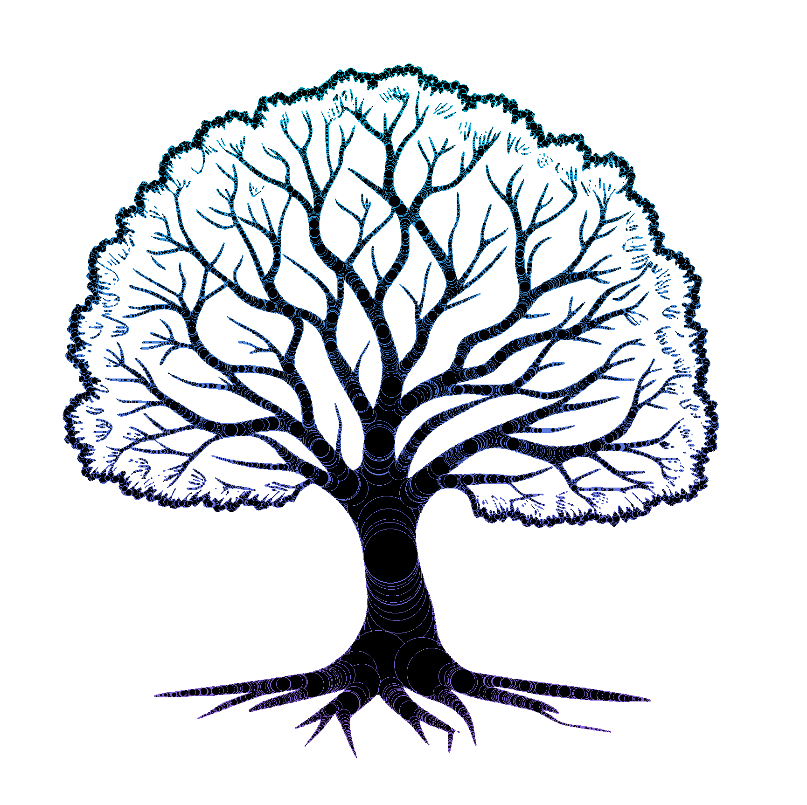
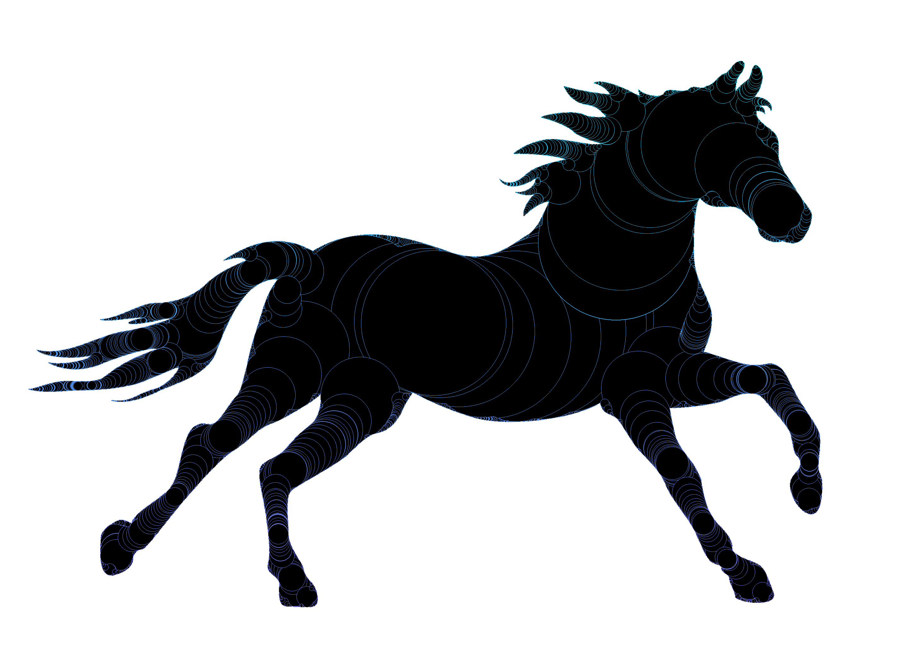

# Appariement de Formes par Squelettisation Hiérarchique (SAE 1.2)

Ce projet, basé sur les travaux de recherche de [Leborgne Aurélie](https://perso.liris.cnrs.fr/laure.tougne/theses_doctorants/these_Aurelie_leborgne.pdf), explore les fondements de la géométrie discrète. L'objectif est de réduire une forme complexe à son essence structurelle via le calcul de la **Distance Euclidienne au Carré (SEDT)** et l'extraction des **boules maximales**.

    
    

---

## Focus Mathématique : L'Optimisation par Séparabilité

L'enjeu majeur de ce projet est le passage d'une approche naïve ( $O(N^4)$ ) vers une solution optimisée en temps linéaire ($O(N^2)$ par rapport au nombre total de pixels).

### 1. La Décomposition de la Distance
La distance euclidienne au carré entre un pixel $P(x, y)$ et un point du fond $Q(i, j)$ s'exprime par :
$$d^2(P, Q) = (x - i)^2 + (y - j)^2$$

L'objectif de la **SEDT** est de trouver le minimum pour tout point $Q$ appartenant au fond ($\mathcal{F}$) :
$$SEDT(x, y) = \min_{(i, j) \in \mathcal{F}} \{ (x - i)^2 + (y - j)^2 \}$$

### 2. L'Approche Séparable
Grâce à la séparabilité de l'opérateur $\min$, nous décomposons le calcul en deux passes indépendantes :
* **Passe Verticale** : Calcul des distances minimales par colonne.
* **Passe Horizontale** : Calcul final par ligne. Géométriquement, cela revient à calculer l'**enveloppe inférieure d'une famille de paraboles**.

---

## Théorie des Boules Maximales

Le squelette est extrait par l'identification des **Boules Maximales**. 

> **Définition** : Une boule est dite "maximale" si elle est incluse dans la forme, mais qu'elle n'est contenue dans aucune autre boule plus grande. 

L'ensemble des centres de ces boules définit l'axe médian de la forme. Cette méthode est **réversible** : la forme originale peut être reconstruite sans perte d'information à partir de ce squelette.

---

## Benchmark de Performance

L'efficacité de l'optimisation a été mesurée via `System.Diagnostics.Stopwatch`.

| Résolution Image | Temps (Brute Force) | Temps (Algorithme Optimisé) | Facteur d'Accélération |
| :--- | :--- | :--- | :--- |
| **100 x 100** | 120 ms | 2 ms | **x60** |
| **500 x 500** | 15 400 ms | 18 ms | **x850** |
| **1000 x 1000** | ~130 s | 45 ms | **x2800** |

---

## Installation & Utilisation

1.  Clonez le dépôt.
2.  Ouvrez `SAE12/codeDemarrage/test_image2.sln` dans **Visual Studio**.
3.  Spécifiez le chemin d'accès à votre image BMP dans `Program.cs`.
4.  Exécutez (`F5`). Les résultats s'affichent en console et les images traitées sont sauvegardées.

## Structure du Projet

- `SAE12`: Contient le code source C# (Algorithmes SEDT et Squelettisation).
- `SAE11`: Contient le **site internet explicatif** détaillé (Ouvrir `pageAccueil.html` dans `SAE11/WWWV2`).

---

# English Version

# Shape Matching by Hierarchical Skeletonization

This project, based on the PhD thesis of [Aurélie Leborgne](https://perso.liris.cnrs.fr/laure.tougne/theses_doctorants/these_Aurelie_leborgne.pdf), focuses on structural shape analysis through **Squared Euclidean Distance Transform (SEDT)** and **Maximal Balls** extraction.

### Key Engineering Insights
- **Complexity Optimization**: Transition from a $O(N^4)$ brute-force approach to a linear-time $O(N^2)$ algorithm using **separable distance transform** properties.
- **Topological Integrity**: The skeleton is defined as the centers of maximal balls, allowing for **lossless shape reconstruction**.
- **Performance**: High-speed processing capable of handling 1000x1000 images in under 50ms (a **2800x speedup** compared to naive methods).

---

### Contact
**Développeur** : Antoine Chaumet
**Remerciements** : Aurélie Leborgne pour les fondements théoriques.
